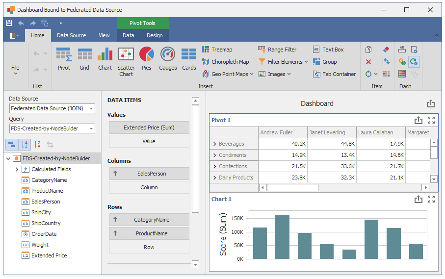

<!-- default file list -->
*Files to look at*:

* [Form1.cs](./CS/DataFederationExample/Form1.cs) (VB: [Form1.vb](./VB/DataFederationExample/Form1.vb))
<!-- default file list end -->

# How to Bind a Dashboard to a Federated Data Source Created at Runtime

This example creates at runtime the following data sources:

* [SQL data source connected to the SQLite database](https://docs.devexpress.com/Dashboard/113925)
* [Excel data source](https://docs.devexpress.com/Dashboard/114766)
* [Object data source](https://docs.devexpress.com/Dashboard/16133)
* [JSON Data Source](https://docs.devexpress.com/Dashboard/401312)

Subsequently [federated data sources](https://docs.devexpress.com/Dashboard/400924) are created to integrate the existing data sources.

This example demonstrates the following query types you can use to create a data federation:

* **Join**
    
    Combines rows from two or more tables based on a column they share. The join type specifies records that have matching values in both tables.

* **Union and UnionAll**

    **Union** combines rows from two or more tables into a single data set and removes duplicate rows in merged tables. **UnionAll** operates in the same manner as **Union**, but duplicates rows from different tables when they contain the same data. You can create a union query for data sources if data types of their columns are [implicitly converted](https://docs.microsoft.com/en-us/dotnet/csharp/programming-guide/types/casting-and-type-conversions#implicit-conversions).        
    
* **Transformation**

    If a data source contains a complex column (an object), you can transform its properties to display them as separate columns in a flattened view. If one of the data column is an array, you can unfold its values and display a new data row for every element of the array. When you unfold the column, you can flatten it and create a flattened view.

The application creates a simple dashboard at runtime, binds it to the [DashboardFederationDataSource](https://docs.devexpress.com/Dashboard/DevExpress.DashboardCommon.DashboardFederationDataSource) created with the Join type and displays the dashboard in the [DashboardDesigner](https://docs.devexpress.com/Dashboard/DevExpress.DashboardWin.DashboardDesigner) control.

## Documantation

- [Federated Data Source](https://docs.devexpress.com/Dashboard/400924)
- [Data Sources](https://docs.devexpress.com/Dashboard/116522)
